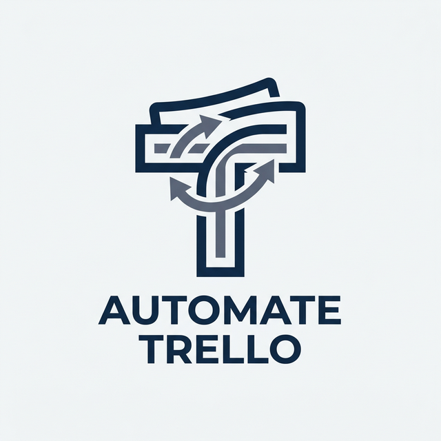

# 🚀 Trello Data Importer Pro



**Trello Data Importer Pro** est une application bureau Python (développée avec `customtkinter`) qui vous permet d'importer rapidement et facilement des tâches depuis un fichier JSON directement vers vos tableaux Trello. L'application dispose d'une interface professionnelle, moderne et intuitive (Dark Mode).

---

## ✨ Fonctionnalités

- 🎨 **Interface Moderne :** Design professionnel avec CustomTkinter.
- ⚡ **Importation Automatique :** Crée des cartes Trello à partir d'un simple fichier JSON.
- 🤖 **Gestion Intelligente :** 
  - Lit le lien Trello et trouve automatiquement le bon ID du tableau.
  - Détecte si le tableau est vide et crée la première liste automatiquement (`Cartes Importées JSON`).
- 🔐 **Sécurisé :** Les clés d'API sont stockées localement via un fichier `.env`.

---

## 🛠️ Prérequis

Assurez-vous d'avoir installé **Python 3.8+** sur votre machine.

Vous aurez besoin de générer vos clés d'API Trello (c'est entièrement gratuit) :
1. Allez sur le site des développeurs Trello : [Trello Power-Ups Admin](https://trello.com/power-ups/admin)
2. Créez un nouveau Power-Up ou utilisez votre clé personnelle existante.
3. Copiez votre **Clé d'API** et générez un **Token secret**.

---

## 📥 Installation

1. **Cloner le projet :**
   ```bash
   git clone https://github.com/charaf12-u/outomate-trello.git
   cd outomate-trello
   ```

2. **Installer les dépendances :**
   L'application utilise des bibliothèques externes définies dans le fichier `requirements.txt`.
   ```bash
   pip install -r requirements.txt
   ```

3. **Configurer les identifiants API :**
   Dans le même dossier que le script `app.py`, créez un fichier nommé exactement `.env` et dotez-le du contenu suivant (remplacez par vos clés) :
   ```env
   TRELLO_API_KEY=votre_cle_api_ici
   TRELLO_TOKEN=votre_token_secret_ici
   ```

---

## 🚀 Utilisation

1. **Lancer l'application :**
   ```bash
   python app.py
   ```
2. **Configuration dans l'interface :**
   - **Lien du tableau Trello :** Entrez le lien vers votre tableau. Par exemple : `https://trello.com/b/VotReliEn/tableau`.
   - **Fichier JSON :** Cliquez sur *Parcourir* et sélectionnez votre document `.json` formaté avec vos tâches.
3. **Importer :**
   - Cliquez sur le bouton "Lancer l'importation". Le programme vérifiera vos accès et convertira le document en véritables cartes Trello ! 

---

## 📄 Format du JSON Attendu

Votre fichier peut avoir deux formats différents :
- **Une simple liste** (tableau d'objets) de cartes.
- **Un projet complexe** encapsulant les cartes dans un attribut `tasks`.

L'application supporte les clés `name` ou `title` pour le titre, et `desc` ou `description` pour le texte. De plus, vous pouvez générer automatiquement une **Checklist** en passant un tableau de chaînes à la clé `checklist`.

Exemple :
```json
{
  "project": {
    "name": "Dashboard Streamlit",
    "description": "Création d'un dashboard interactif."
  },
  "tasks": [
    {
      "title": "Connexion à PostgreSQL",
      "description": "Se connecter à la base de données et vérifier les données.",
      "checklist": [
        "Installer sqlalchemy et psycopg2",
        "Tester connexion PostgreSQL"
      ]
    },
    {
      "title": "Création visualisations",
      "description": "Créer graphiques avec seaborn et matplotlib."
    }
  ]
}
```
> **Note :** Les éléments dans `checklist` s'ajouteront automatiquement sous forme de cases à cocher dans votre carte Trello !

---

## 🤝 Contribution

Les Pull Requests sont les bienvenues. Pour les changements majeurs, veuillez d'abord ouvrir une `issue` pour discuter de ce que vous aimeriez changer.

**© 2026 - Développé pour automatiser et simplifier la gestion de tâches sur Trello.**
